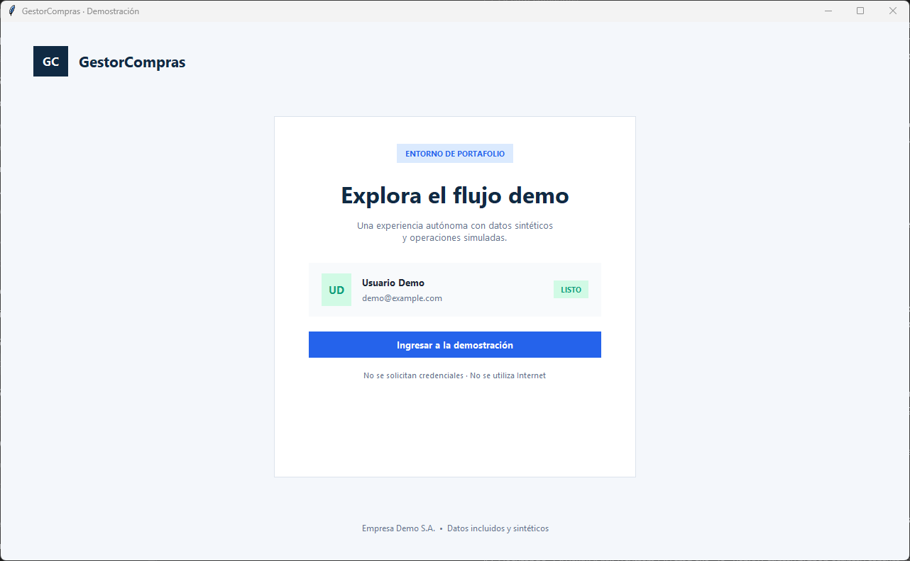
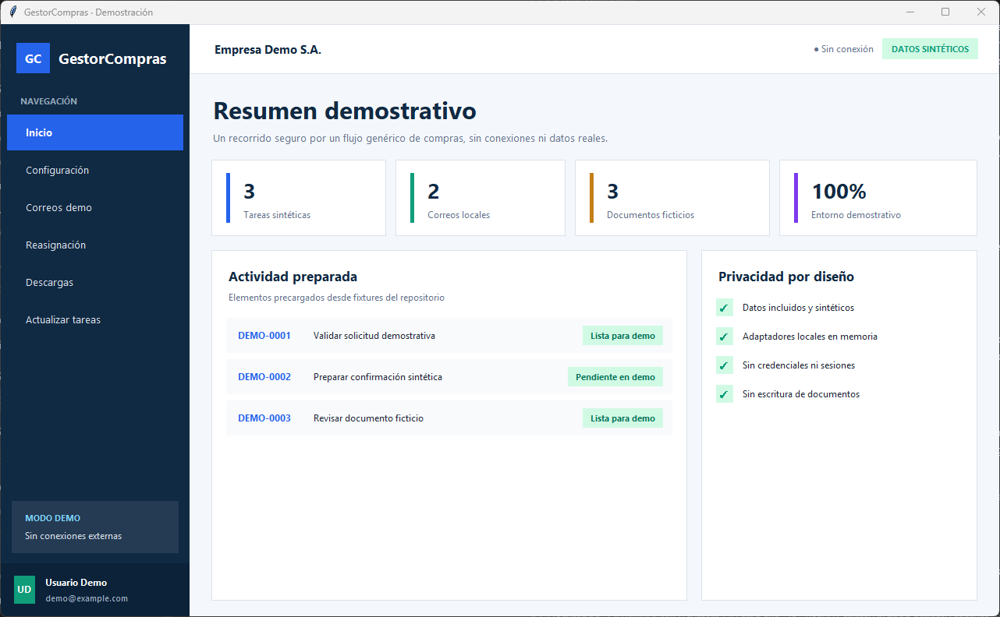
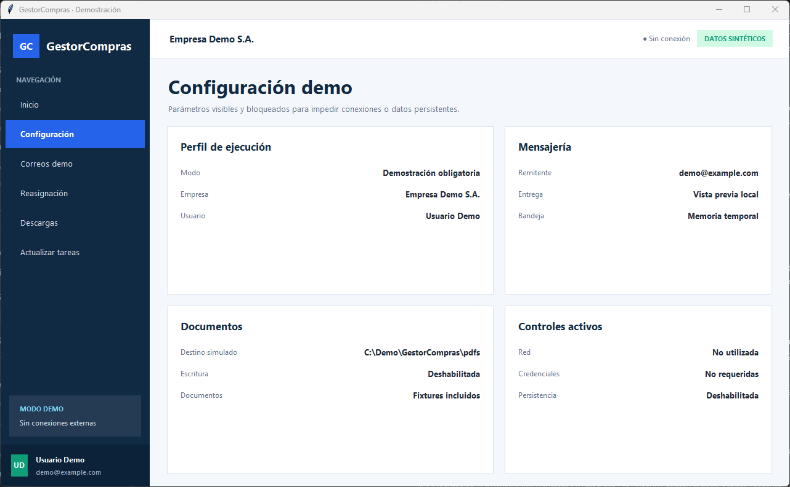
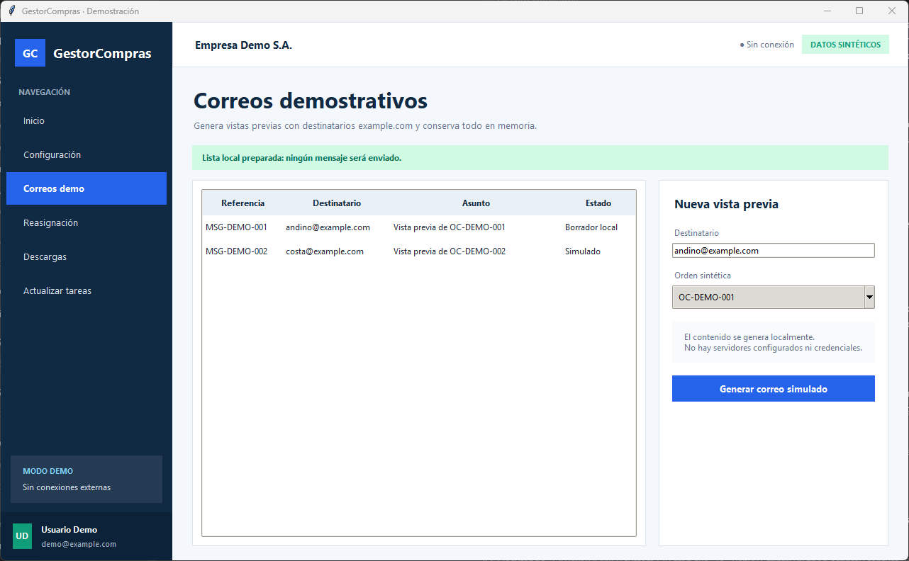
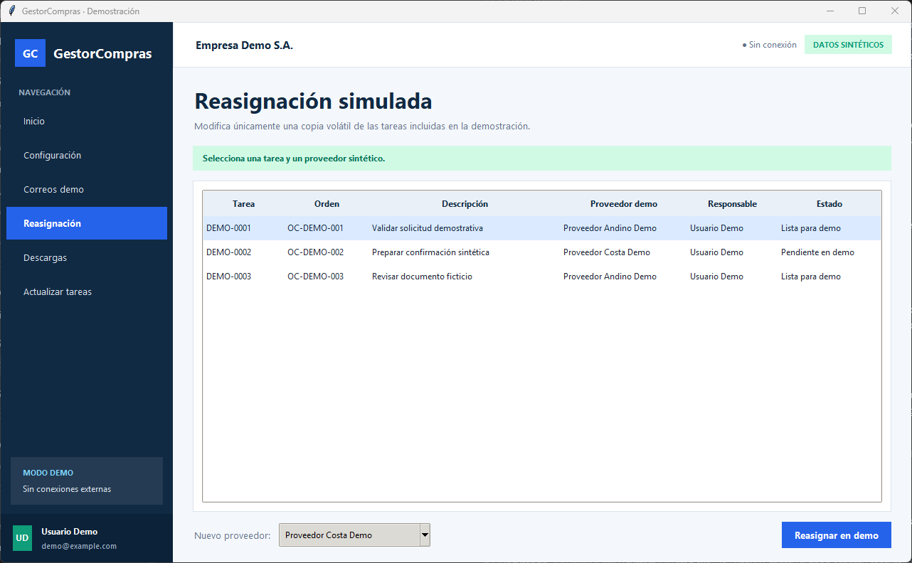
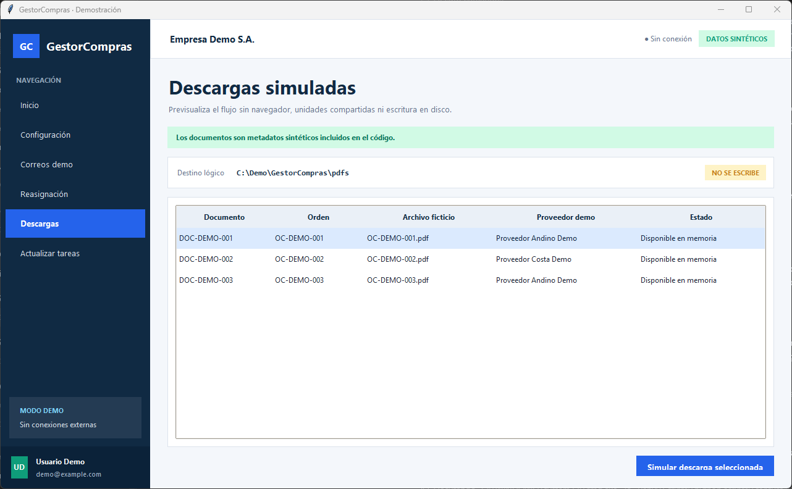
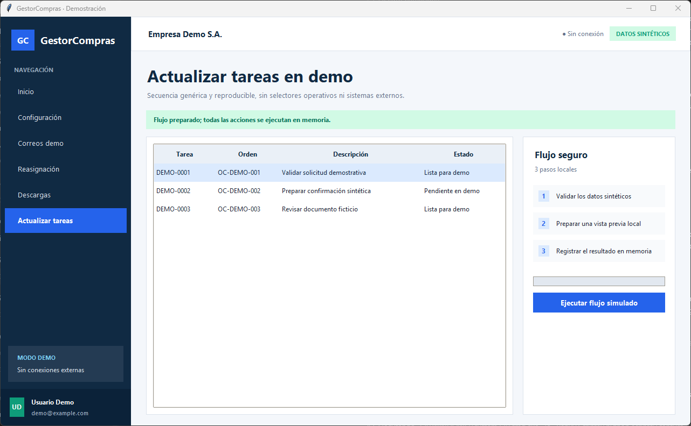

# GestorCompras

Aplicación de escritorio en Python que demuestra cómo organizar flujos repetitivos de compras en una interfaz clara, auditable y desacoplada. Esta edición está diseñada como proyecto de portafolio: funciona de forma autónoma y utiliza únicamente datos sintéticos.

## Problema que aborda

Los equipos que coordinan solicitudes, órdenes, comunicaciones y documentos suelen alternar entre varias herramientas y repetir tareas manuales. GestorCompras reúne esos pasos en un recorrido de escritorio demostrativo para explorar estados, acciones y controles de privacidad sin depender de sistemas externos.

## Funcionalidades demostrativas

- Acceso directo con una identidad sintética, sin autenticación.
- Resumen de tareas, mensajes y documentos incluidos como fixtures.
- Configuración visible y bloqueada en modo demo.
- Generación local de vistas previas de correo.
- Reasignación de tareas en memoria.
- Descarga simulada de documentos sin escritura en disco.
- Actualización de tareas mediante un flujo genérico de tres pasos.
- Auditoría automática de privacidad antes de publicar cambios.

## Arquitectura

```text
GestorCompras
├── gestorcompras
│   ├── core          # configuración, modelos y composición
│   ├── demo          # fixtures sintéticos y deterministas
│   ├── gui           # aplicación, pantallas, tema y componentes
│   └── services      # interfaces y adaptadores en memoria
├── scripts           # capturas reproducibles y control de privacidad
├── docs\images       # capturas generadas desde la aplicación pública
├── tests             # aislamiento, servicios, navegación y privacidad
└── run.py            # punto de entrada
```

La interfaz depende de contratos pequeños. La composición pública solo crea `DemoMailService`, `DemoTaskService` y `DemoStorageService`; ninguno abre conexiones ni guarda datos.

## Requisitos

- Windows 10 o posterior.
- Python 3.12.
- Conexión a Internet únicamente si el entorno aún necesita descargar las dependencias de desarrollo. La aplicación ya instalada funciona sin Internet.

## Instalación

Ejecuta estos comandos desde `cmd.exe` en la raíz del proyecto:

```bat
py -3.12 -m venv .venv
.venv\Scripts\python -m pip install --upgrade pip
.venv\Scripts\python -m pip install -r requirements.txt
.venv\Scripts\python -m pip install -r requirements-dev.txt
```

## Ejecución

```bat
.venv\Scripts\python run.py
```

La aplicación siempre arranca en modo demostración. No necesita archivo `.env`, correo, credenciales, navegador automatizado, base de datos ni unidad compartida.

## Pruebas y privacidad

```bat
.venv\Scripts\python -m pytest -q
.venv\Scripts\python -m compileall -q .
.venv\Scripts\python scripts\privacy_check.py
```

Para regenerar las capturas desde la ventana real de la aplicación:

```bat
.venv\Scripts\python scripts\capture_demo.py
```

## Política de datos sintéticos

Todo valor visible pertenece a los fixtures versionados. Se utilizan entidades como Empresa Demo S.A., Usuario Demo, Proveedor Andino Demo, Proveedor Costa Demo, órdenes `OC-DEMO-001` y tareas `DEMO-0001`. Los correos terminan en `example.com`. Las operaciones viven solo durante la sesión y desaparecen al cerrar la aplicación.

Consulta [PRIVACY.md](PRIVACY.md) y [SECURITY.md](SECURITY.md) antes de contribuir.

## Capturas nuevas

### Acceso demostrativo



### Inicio



### Configuración



### Correos



### Reasignación



### Descargas



### Actualización de tareas



## Licencia

MIT. Consulta [LICENSE](LICENSE).
